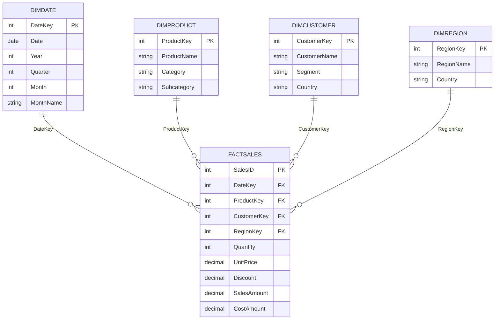

# Data Model: Sales Performance Star Schema

## Overview
This model follows a star schema design: a single wide fact table surrounded by conformed dimension tables. This keeps DAX simpler, improves query performance, and avoids the extra join hops and filter-propagation issues that come with a snowflake design.

## Tables

### Fact Table: FactSales
- SalesID (PK)
- DateKey (FK -> DimDate)
- ProductKey (FK -> DimProduct)
- CustomerKey (FK -> DimCustomer)
- RegionKey (FK -> DimRegion)
- Quantity
- UnitPrice
- Discount
- SalesAmount
- CostAmount

### Dimension Tables
- DimDate: DateKey, Date, Year, Quarter, Month, MonthName, Week, DayOfWeek, IsWeekend, FiscalYear
- DimProduct: ProductKey, ProductName, Category, Subcategory, Brand, UnitCost
- DimCustomer: CustomerKey, CustomerName, Segment, Country, SignupDate
- DimRegion: RegionKey, RegionName, Country, SalesManager

## Relationships
- FactSales[DateKey] -> DimDate[DateKey] (many-to-one, single direction)
- FactSales[ProductKey] -> DimProduct[ProductKey] (many-to-one, single direction)
- FactSales[CustomerKey] -> DimCustomer[CustomerKey] (many-to-one, single direction)
- FactSales[RegionKey] -> DimRegion[RegionKey] (many-to-one, single direction)

## Design Principles Applied
- Star schema over snowflake to minimize join paths and keep DAX filter context predictable.
- Single-direction filter propagation from dimensions to the fact table; bidirectional filtering is avoided unless a specific many-to-many bridge table requires it.
- A dedicated DimDate table, marked as the official Date Table in Power BI, to support all time intelligence functions.
- Surrogate integer keys used for every relationship instead of natural keys, for smaller storage footprint and faster joins.
- Denormalized dimension attributes (e.g. Category and Subcategory both on DimProduct) to avoid unnecessary snowflaking.

## Entity Relationship Diagram

